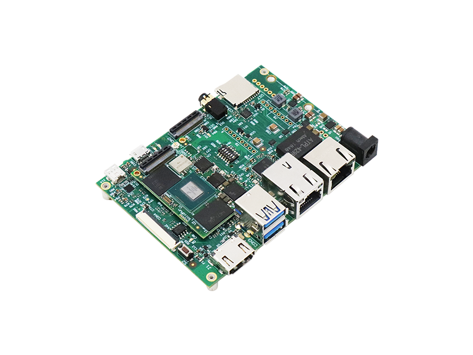

# SolidRun iMX8MPlus

*This is a work in progress.*

This is the base Nerves System configuration for the [SolidRun iMX8MPlus](https://www.solid-run.com/embedded-industrial-iot/nxp-i-mx8-family/hummingboard-m/).

 [Image credit](#solidrun)

| Feature              | Description                      |
| -------------------- | -------------------------------- |
| CPU                  | 1.8 GHz Quad-core ARM Cortex-A53 |
| Memory               | 1 GB DRAM                        |
| Storage              | 8 GB eMMC Flash and MicroSD      |
| Linux kernel         | 5.10 w/ patches                  |
| IEx terminal         | UART `ttymxc1`                   |
| GPIO, I2C, SPI       | Yes - [Elixir Circuits](https://github.com/elixir-circuits) |
| Display              | TBD                             |
| ADC                  | TBD                             |
| PWM                  | TBD                             |
| UART                 | ttymxc1                         |
| Camera               | TBD                             |
| Ethernet             | Two 1000 Mbps (eth0 and eth1)   |
| WiFi                 | TBD                             |
| RTC                  | Yes w/ battery                  |

[Image credit](#solidrun): This image is from [SolidRun](https://www.solid-run.com/).
